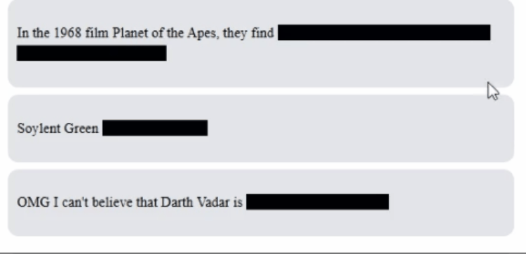
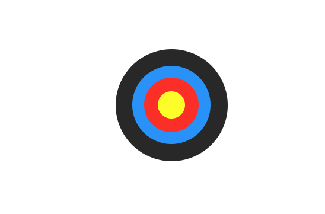
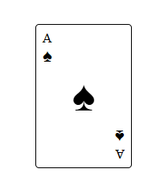
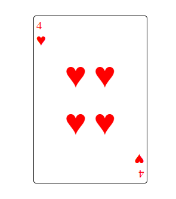

# CSS Challenges

This repository contains my solutions to the [CSS Challenges on Scrimba](https://v2.scrimba.com/css-challenges-c02p). These challenges have been incredibly helpful in honing my CSS skills.

Challenges:

1. [Spoiler Revealer](https://github.com/MahmoodHashem/css-challenges/tree/main/spoiler-revealer)

   
2. [Colorful Button](https://github.com/MahmoodHashem/css-challenges/tree/main/colorful-btn)

   

3. Expandable Searchbar

   

4. [Codepen Tile](https://github.com/MahmoodHashem/css-challenges/tree/main/codepen-tile)

   

5. [Loading Animation](https://github.com/MahmoodHashem/css-challenges/tree/main/loading-animation1)

   

6. [Loading Animation 2](https://github.com/MahmoodHashem/css-challenges/tree/main/loading-animation2)

   

7. [Loading Animation 3](https://github.com/MahmoodHashem/css-challenges/tree/main/loading-animation3)

   

8. [Archery Targe](https://github.com/MahmoodHashem/css-challenges/tree/main/archery-target)

   

9. [Word Carousel](https://github.com/MahmoodHashem/css-challenges/tree/main/word-carousel)

   

10. [Flag of France](https://github.com/MahmoodHashem/css-challenges/tree/main/france-flage)

    

11. [Flag of Germeny](https://github.com/MahmoodHashem/css-challenges/tree/main/germany-flag)

    

12. [Flag of Madagascar](https://github.com/MahmoodHashem/css-challenges/tree/main/madagascar-flag)

    

13. [Flag of Japan](https://github.com/MahmoodHashem/css-challenges/tree/main/japan-flag)
    

14. [Flag of Switzerland](https://github.com/MahmoodHashem/css-challenges/tree/main/switzerland-flag)

    

15. [Github Profile](https://github.com/MahmoodHashem/css-challenges/tree/main/github-profile)

    

16. [Toggle Switch](https://github.com/MahmoodHashem/css-challenges/tree/main/toggle-switch)

    

17. [Play Card - Ace of Spade](https://github.com/MahmoodHashem/css-challenges/tree/main/playCard-AceOfSpade)

    
    
18. [Play Card - Heart of 4](https://github.com/MahmoodHashem/css-challenges/tree/main/playCard-4ofHeart)

    
    
19. [Card Flip](https://github.com/MahmoodHashem/css-challenges/tree/main/card-flip)

    
    
20. [Instagram Story](https://github.com/MahmoodHashem/css-challenges/tree/main/instagram)

    
    
21. [Animated Progress bar](https://github.com/MahmoodHashem/css-challenges/tree/main/animated-progressbar)

    
    
22. [Github Contribution Graph](https://github.com/MahmoodHashem/css-challenges/tree/main/github-contribution-graph)

    
